# Meetup Resources

In this folder, you can find the presentation and minutes of each meetup.
This readme contains the links to minutes, presentation files and the recordings of the presentations.

Note: Presentation files use the pattern `YEAR-MONTH-WoTCG-EVENTNAME-PRESENTERNAME.FILETYPE`.

## Latest Meetups

<table>
<tr>
<td width="440"><a href="https://youtu.be/xMIHykB_ebg">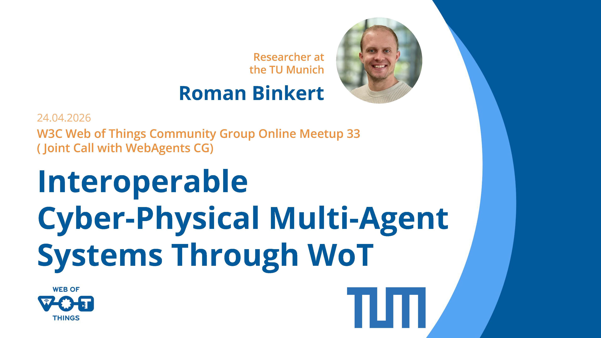</a></td>
<td><b>Interoperable Cyber-Physical Multi-Agent Systems Through WoT</b>
  
<b>Presenter:</b> Roman Binkert - TU Munich 

Bio
 Roman Binkert is a Ph.D. candidate at the Associate Professorship of Embedded Systems and IoT at the Technical University of Munich (TUM). His research focuses on developing interoperable Cyber-Physical IoT systems by leveraging the W3C Web of Things to integrate diverse information sources and devices into the Industrial Metaverse. A central goal of his work is to ensure that complex system data is made intuitively understandable and actionable for both autonomous agents and human users.

 
<b>Date:</b> 24 April 2026
  
<a href="https://youtu.be/xMIHykB_ebg">Video</a> • <a href="./33/2026-04-WoTCG-Meetup33-WoMaT-Binkert.pdf">Presenter Slides</a> • Intro Slides: <a href="https://docs.google.com/presentation/d/19i_sRMWO3mKbv_SeGMMOaegaxYLIgY-acfMxwdVD-Jo/edit?usp=sharing">Google Slides</a> | <a href="./33/2026-04-WoTCG-Meetup33-AguzziKorkan.pdf">PDF</a> • <a href="./33/2026-04-24-minutes.md">Minutes</a> • <a href="https://www.w3.org/events/meetings/c5855bad-fd18-45ce-973f-e0f716dd6bed/20260424T160000/">W3C Event Page</a>
  

Description
 In this session, Roman Binkert talks about Interoperable Cyber-Physical Multi-Agent Systems Through W3C Web of Things. He introduces a framework for bridging the gap between Multi-Agent Systems (MAS) and the physical world using Web of Things (WoT) standards.
</td>
</tr>
<tr>
<td width="440"><a href="https://youtu.be/-ZJ3A0txXD8">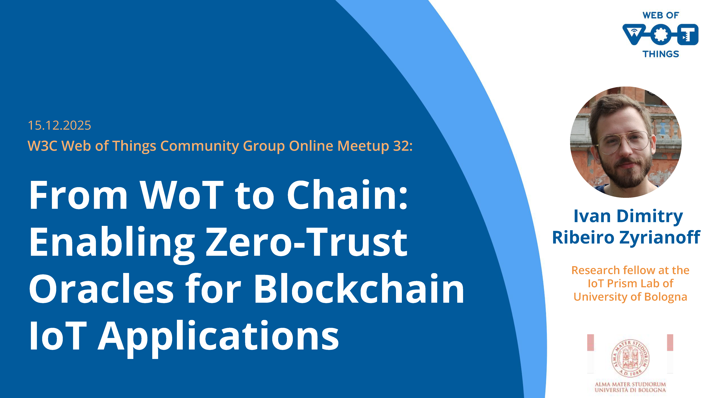</a></td>
<td><b>From WoT to Chain: Enabling Zero-Trust Oracles for Blockchain IoT Applications</b>
  
<b>Presenter:</b> Ivan Dimitry Ribeiro Zyrianoff 

Bio
 Ivan is a Research Fellow from the University of Bologna and a member of the IoT-Prism lab. He received a Ph.D. in structural and environmental health monitoring and management from the University of Bologna in 2024. He was involved in numerous national and European projects centered on IoT applied to different contexts. His current research topics encompass interoperability for the Internet of Things, Edge Computing, and Edge Caching.

 
<b>Date:</b> 15 December 2025
  
<a href="https://youtu.be/-ZJ3A0txXD8">Video</a> • <a href="./32/2025-12-WoTCG-Meetup32-Zonia-Ivan.pdf">Presenter Slides</a> • Intro Slides: <a href="https://docs.google.com/presentation/d/1bYQHcKImeMGR2CT3MWXJwDegtzpbZq5AKTssvVhR5Ww/edit?usp=sharing">Google Slides</a> | <a href="./32/2025-12-WoTCG-Meetup32-AguzziKorkan.pdf">PDF</a> • <a href="./32/2025-12-15-minutes.md">Minutes</a> • <a href="https://www.w3.org/events/meetings/fb10b377-c5a7-4ee9-ae60-89a2a5cc627d/">W3C Event Page</a>
  

Description
 In this meetup, we welcome Ivan Dimitry Ribeiro Zyrianoff from the University of Bologna. He presents ZONIA, a zero-trust decentralized oracle network that improves data integrity and interoperability in IoT systems by bridging with the blockchain. He focuses on the WoT integration and showcases experiments on parametric insurance using IoT sensor data.
</td>
</tr>
<tr>
<td width="440"></td>
<td><b>Managing Device Descriptions with the Thing Model Catalog</b>
  
<b>Presenter:</b> Ege Korkan 

Bio
 Ege Korkan is a long time supporter of the Web of Things standardization and open-source activities. He works as an IoT architect at the CTO office and is responsible for leading the development of the Thing Model Catalog, which he will present today.

 
<b>Date:</b> 4 December 2025
  
<a href="https://youtu.be/CuZo1NGshiI">Video</a> • <a href="./31/2025_12_04-WoTCG-Meetup31-TMC-Siemens.pdf">Presenter Slides</a> • Intro Slides: <a href="https://docs.google.com/presentation/d/1CP2MG7h40Y6WSnGVpnGJnmURlpPJz-PBZ2XLd53MGPE/edit?usp=sharing">Google Slides</a> | <a href="./31/2025-12-WoTCG-Meetup31-AguzziKorkan.pdf">PDF</a> • <a href="./31/2025-12-04-minutes.md">Minutes</a> • <a href="https://www.w3.org/events/meetings/7c3a1c29-fb69-464a-b14c-fbaaad597c37/">W3C Event Page</a>
  

Description
 In this meetup, Ege Korkan from Siemens introduces the Thing Model Catalog, an open-source project to manage Thing Models of devices from different authors, manufacturers and products. He explains the motivation behind, different ways to use it and launch a new event for the community participants.
</td>
</tr>
</table>

Show 31 older meetup(s)

## Meetup 30

- Name: Enabling IoT in buildings with BACnet and Web of Things
- Presenter:
  - Doğan Fennibay
    

Bio
 Doğan Fennibay is a Principal Key Expert at Siemens, specializing in automation and system architecture. With deep expertise in industrial and building automation, Doğan focuses on advancing the transformation of automation systems into the IoT era through the open nature of the web.

- Date: 20 November 2025
- [Presenter Slides](./30/2025-11-WoTCG-Meetup30-WoT-BACnet-Fennibay-Siemens.pdf)
- Intro Slides: [Google Slides](https://docs.google.com/presentation/d/1DUDu4RJXJWP_mEaOuHMW-hcQ33pgF8_kWIUgKGs3JkQ/edit?usp=sharing) | [PDF](./30/2025-11-WoTCG-Meetup30-AguzziKorkan.pdf)
- [Video](https://youtu.be/VSZA8wjjUIo)
- [Minutes](./30/2025-11-20-minutes.md)
- [W3C Event Page](https://www.w3.org/events/meetings/9019e90f-f2c5-4c04-88f5-51bac8c02246/)

Description

In this meetup, we welcome Doğan Fennibay from Siemens! He begins by explaining how the BACnet (Building Automation and Control Network) open protocol transformed building automation by allowing devices from different manufacturers to communicate seamlessly and achieve broad market adoption. He then introduces the Web of Things–BACnet protocol binding, which takes this further by integrating BACnet-based automation systems with the Web and the Internet of Things. Finally, he shows how these two worlds can be connected in a lightweight way and the new use cases this unlocks.

## Meetup 29

<a href="https://youtu.be/PlY-ixquyZc">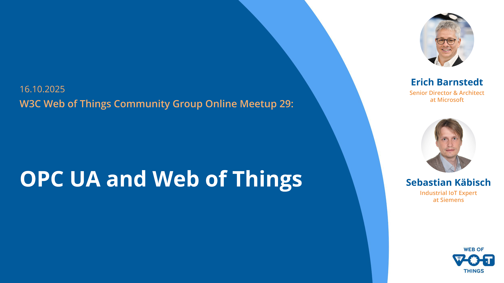</a>

- Name: OPC UA and Web of Things
- Presenters:
  - Erich Barnstedt
    

Bio
 Erich has worked in various engineering roles at Microsoft for over 22 years, initially in the Windows team and later in the Azure team. Throughout his career, he worked in the automotive and manufacturing verticals and is the founder of both the Windows and the Azure Industrial IoT teams. He is the inventor of many Industrial IoT products from Microsoft. More recently, he shifted his work to the support of open industrial standards in Microsoft products as well as commitments to open-source and consortia work in the Corporate Standards Group at Microsoft as Senior Director and Architect.

  - Sebastian Kaebisch
    

Bio
 Dr. Sebastian Käbisch is a Principal Key Expert at Siemens Foundational Technologies in Munich, Germany. His work focuses on the efficient realization and usage of standardized Internet & Web technologies for the Industrial Internet of Things domain. He leads strategic initiatives, research, and development for Siemens business units such as industrial and building automation. Sebastian is co-chair of the W3C Web of Things and chairs the OPC UA Binding for Web of Things working group at the OPC Foundation.

- Date: 16 October 2025
- [Presenter Slides - Erich](./29/2025-10-WoTCG-Meetup29-Barnstedt-Microsoft.pdf)
- [Presenter Slides - Sebastian](./29/2025-10-WoTCG-Meetup29-Kaebisch-Siemens.pdf)
- Intro Slides: [Google Slides](https://docs.google.com/presentation/d/1SeGbmA9skmgVQEbsnO2904Lj8ztp-HsCX9M3MIxbSWc/edit?usp=sharing) | [PDF](./29/2025-10-WoTCG-Meetup29-AguzziKorkan.pdf)
- [Video](https://youtu.be/PlY-ixquyZc)
- [Minutes](./29/2025-10-16-minutes.md)
- [W3C Event Page](https://www.w3.org/events/meetings/b0b77d2e-5c92-4338-84ce-af3e6094a341/)

Description

In this meetup, we welcome Erich Barnstedt from Microsoft and Sebastian Käbisch from Siemens. They show how Web of Things is becoming a successful building block for industrial automation systems built with OPC UA. First, they show TDs can be used to onboard non OPC UA devices and then explain how to represent OPC UA servers with TDs using the OPC UA Binding. Also, you get to see open-source projects supporting both workflows.

## Meetup 28

<a href="https://youtu.be/EkeoQLWIhlI">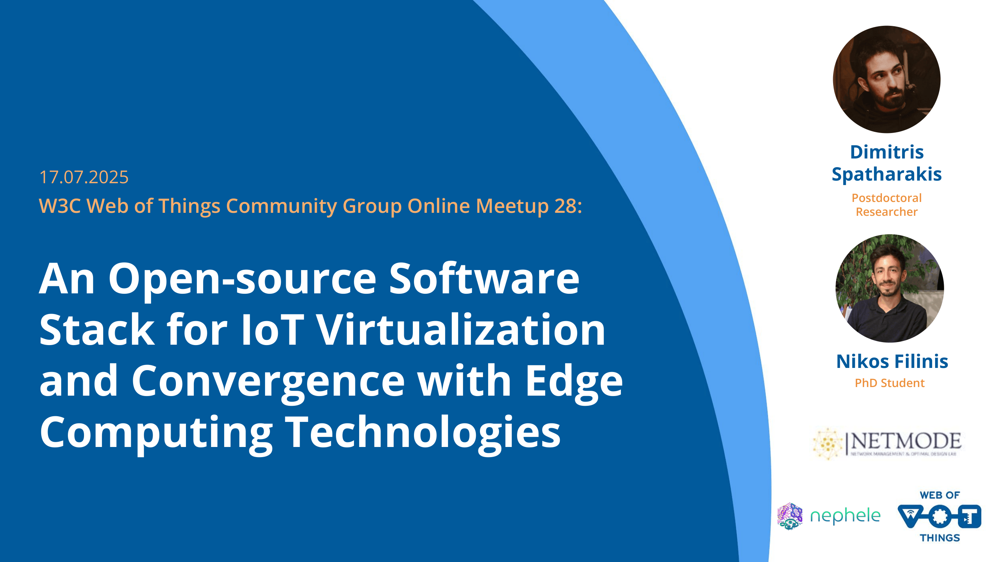</a>

- Name: An Open-source Software Stack for IoT Virtualization and Convergence with Edge Computing Technologies
- Presenters:
  - Dimitrios Spatharakis
    

Bio
 Dimitrios Spatharakis is a postdoctoral fellow in the NETMODE Lab at NTUA. His research interests focus on IoT, cyber-physical systems, edge computing and cloud computing. He has been involved as a researcher in several European and National R&D projects.

  - Nikos Filinis
    

Bio
 Nikos Filinis is pursuing his PhD at NTUA. His research interests lie in the areas of intelligent orchestration mechanisms for cloud and edge computing resources, reinforcement learning, software stacks for IoT, 5G networks and software development.

- Date: 17 July 2025
- [Presenter Slides](./28/2025-07-WoTCG-Meetup28-VO-WoT.pdf)
- Intro Slides: [Google Slides](https://docs.google.com/presentation/d/1iQjM7CGnVCx1XQCK2bi3iIfUCfIDwqTdjEng5ebfCEQ/edit?usp=sharing) | [PDF](./28/2025-07-WoTCG-Meetup28-AguzziKorkan.pdf)
- [Video](https://youtu.be/EkeoQLWIhlI)
- [Minutes](./28/2025-07-17-minutes.md)
- [W3C Event Page](https://www.w3.org/events/meetings/d5ca8089-230f-4126-9e95-5b7446784a6d/)

Description

In this meetup, we welcome Dr. Dimitris Spatharakis and Nikos Filinis from the NETMODE Lab at the National Technical University of Athens, Greece. They talk about the design and implementation of a software stack that supports IoT virtualization through the development of Virtual Objects (VOs) that encapsulate WoT Things. VOs provide an abstraction layer over real IoT devices while augmenting their capabilities through a multi-layer software stack, called the VOStack. The VOStack is an open-source software stack that supports interaction with both physical IoT devices and edge/cloud computing orchestration platforms. The implementation of VOStack is aligned with the WoT specifications and is implemented in the framework of the NEPHELE Horizon Europe project (https://nephele-project.eu/).

## Meetup 27

<a href="https://youtu.be/p-iU_B6MQFo">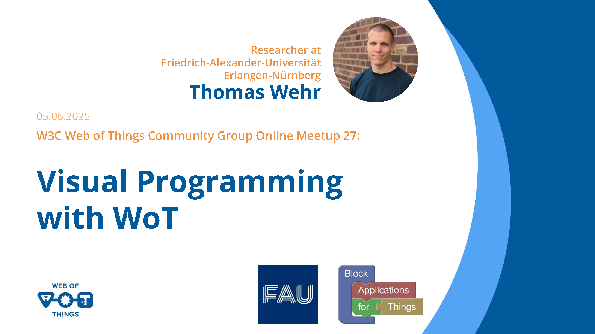</a>

- Name: Visual Programming with WoT
- Presenter:
  - Thomas Wehr
    

Bio
 Thomas Wehr is pursuing a PhD at the Chair for Technical Information Systems of FAU since March 2024. Many of the Chair's research projects involve the Web of Things, including implementing a WoT baggage system at Munich Airport (meetup 17!), developing an Android health app interacting with wearables described with TDs, and extending TDs with preconditions and effects to enable planning. The Chair's research focuses on the Semantic Web, Linked Data, and Knowledge Graphs, working closely with the Data Spaces and Internet of Things Solutions department at the Fraunhofer Institute for Integrated Circuits.

- Date: 5 June 2025
- [Presenter Slides](./27/2025-06-WoTCG-Meetup27-BLAST-FAU.pdf)
- Intro Slides: [Google Slides](https://docs.google.com/presentation/d/1JQcGoVY-3I_RCkKpGqoLGjR0XRAJSmRMYVTF7gPh4G0/edit?usp=sharing) | [PDF](./27/2025-06-WoTCG-Meetup27-AguzziKorkan.pdf)
- [Video](https://youtu.be/p-iU_B6MQFo)
- [Minutes](./27/2025-06-05-minutes.md)
- [W3C Event Page](https://www.w3.org/events/meetings/9eea7c28-e07f-4f47-9ce5-4b79f47abffe/)

Description

In this meetup, we welcome Thomas Wehr from the Friedrich-Alexander-Universität Erlangen-Nürnberg. He presents BLAST - Block Applications for Things, a browser-based visual programming and execution environment for WoT Consumers. BLAST includes custom protocol bindings for Bluetooth and HID devices, allowing for end users to quickly create applications that interact with a broad range of devices. Applications are created by geometrically arranging blocks, either predefined blocks or blocks dynamically generated from Thing Descriptions.

## Meetup 26

<a href="https://youtu.be/JxGcW70tqfk">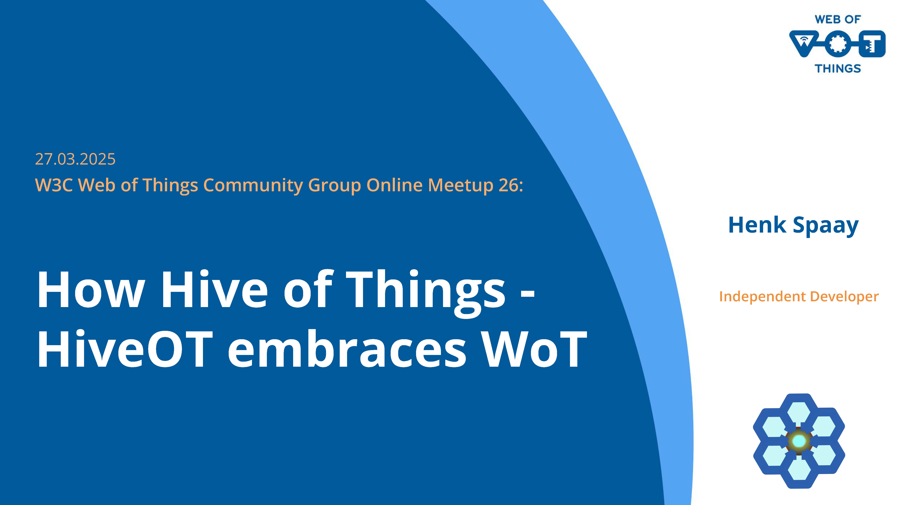</a>

- Name: How the Hive of Things - HiveOT - embraces WoT
- Presenter:
  - Henk Spaay
    

Bio
 Henk Spaay is a retired Senior Software Engineer and development manager. He was educated as Electronics Engineer and has over 30 years of software development experience in embedded industrial and consumer solutions.

- Date: 27 March 2025
- [Presenter Slides](./26/2025-03-WoTCG-Meetup26-HiveOT.pdf)
- Intro Slides: [Google Slides](https://docs.google.com/presentation/d/192ScNSZCw31CBW2r9Omipr5hJTe8fLsP9tB6ZSNsbVw/edit?usp=sharing) | [PDF](./26/2025-03-WoTCG-Meetup26-AguzziKorkan.pdf)
- [Video](https://youtu.be/JxGcW70tqfk)
- [Minutes](./26/2025-03-27-minutes.md)
- [W3C Event Page](https://www.w3.org/events/meetings/08a75b44-0e01-4926-ad7d-4755317ee8a4/)

Description

In this meetup, we dive into the use of WoT standards in building the HiveOT Hub together with Henk. After learning about its objectives and history, we will see how the Thing Description documents facilitates the interaction between consumers and Things using a hub and digital twins. He will also explain the challenges he encountered in using WoT standards during development.

## Meetup 25

<a href="https://youtu.be/gcpHYtqTBbA">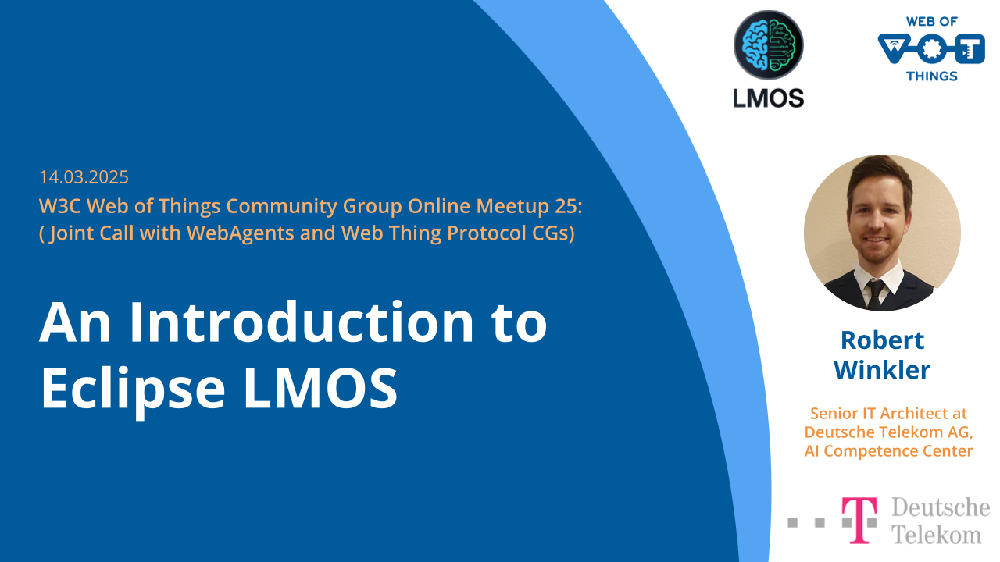</a>

- Name: An Introduction to Eclipse LMOS
- Presenter:
  - Robert Winkler
    

Bio
 Enterprise and solution architect at Deutsche Telekom with a focus on distributed systems, cloud computing, Internet of Things and conversational AI. Solution Architect at day, Gamer at night.

- Date: 14 March 2025
- [Presenter Slides](./25/2025-03-WoTCG-Meetup25-LMOS-DeutscheTelekomEclipse.pdf)
- Intro Slides: [Google Slides](https://docs.google.com/presentation/d/1K-ZriSHVq_q_mbTvx3pa98C7ytST3Ak7YGHhqdHWnPM/edit?usp=sharing) | [PDF](./25/2025-03-WoTCG-Meetup25-AguzziKorkan.pdf)
- [Video](https://youtu.be/gcpHYtqTBbA)
- [Minutes](./25/2025-03-14-minutes.md)
- [W3C Event Page](https://www.w3.org/events/meetings/5a77b997-467b-4d5d-bb40-b84789c17d2e/20250314T090000/)

Description

In this special session, we have three community groups joining for a presentation by Robert Winkler from Deutsche Telekom on the Eclipse LMOS project.

## Meetup 24

<a href="https://youtu.be/ARffaQ543Lo">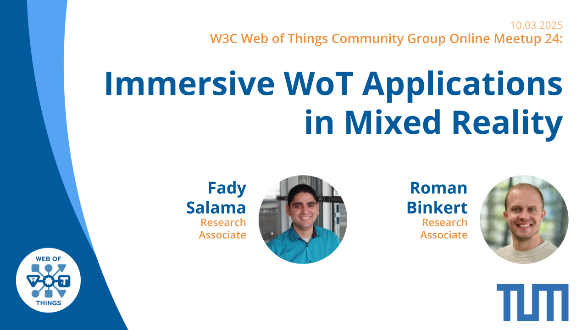</a>

- Name: Immersive WoT Applications in Mixed Reality
- Presenters:
  - Fady Salama
    

Bio
 Fady Salama is a Research Associate in the Professorship of Embedded Systems and IoT, TUM. He began his research journey by exploring innovative approaches to integrating the Web of Things with complex cyber-physical systems, aiming to enhance their description, interaction, and interoperability.

  - Roman Binkert
    

Bio
 Roman Binkert is a Research Associate at the same research group as Fady. He is interested in Web of Things and how to apply it for manufacturing, robotics and the industrial metaverse.

- Date: 10 March 2025
- [Presenter Slides](./24/2025-03-WoTCG-Meetup24-Immersive_WoT_Apps_in_MR-TUM.pdf)
- Intro Slides: [Google Slides](https://docs.google.com/presentation/d/16EdKkX29RnluzM9PbSPEcgcrkeJER8Vt4hMhR8lTXb4/edit?usp=sharing) | [PDF](./24/2025-03-WoTCG-Meetup24-AguzziKorkan.pdf)
- [Video](https://youtu.be/ARffaQ543Lo)
- [Minutes](./24/2025-03-10-minutes.md)
- [W3C Event Page](https://www.w3.org/events/meetings/f3841afd-9304-447e-8e60-cb0ae6cc326b/)

Description

In this meetup, we welcome Fady Salama and Roman Binkert from the Technical University of Munich. They will talk about how WoT simplifies interacting with the devices and creating mashups of devices in mixed reality environments. They will introduce HoloWoT, a Unity application that works with Mixed Reality Headsets such as Hololens. Its open-source components such as the new .Net library WoT.Net will be also introduced for those who want to build other applications based on that.

## Meetup 23

<a href="https://youtu.be/p17C3mrY720">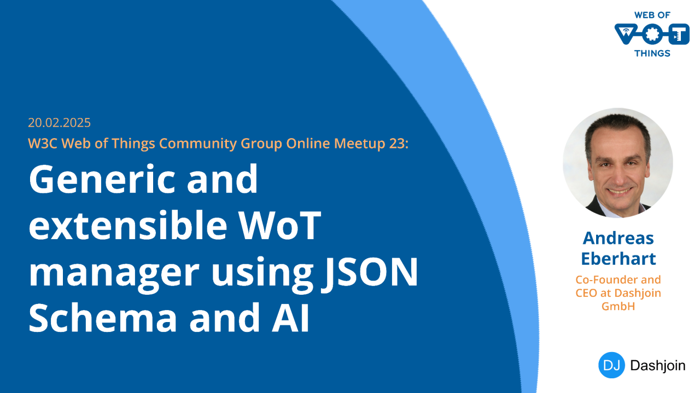</a>

- Name: Generic and Extensible Web of Things Manager Using JSON Schema & AI
- Presenter:
  - Andreas Eberhart
    

Bio
 With 25 years of professional experience, Andreas is very proficient in the areas of enterprise cloud, linked & big data, as well as systems architecture and development. He co-founded two startups and drove their growth resulting in two acquisitions by silicon valley giants HP and Veritas. Combined with his extensive background in cutting edge research, he has the unique ability to address projects from technical, time to market, and ROI angles. Currently, Andreas is the CEO of Dashjoin, a provider of an innovative low code platform.

- Date: 20 February 2025
- [Presenter Slides](./23/2025-02-WoTCG-Meetup23-Generic_WoT_Manager-Dashjoin.pdf)
- Intro Slides: [Google Slides](https://docs.google.com/presentation/d/1tqunc65fBHE6z2K0bPnSxNvXHyMLkyF3baVE46Uz8QM/edit?usp=sharing) | [PDF](./23/2025-02-WoTCG-Meetup23-AguzziKorkan.pdf)
- [Video](https://youtu.be/p17C3mrY720)
- [Minutes](./23/2025-02-20-minutes.md)
- [W3C Event Page](https://www.w3.org/events/meetings/665e7589-ace6-4fe2-a8cb-ed9c167ea175/)

Description

In this meetup, we welcome Andreas Eberhart from Dashjoin! He introduces Dashjoin's low-code platform and explains how he has leveraged WoT to build a generic manager that allows for any IoT device to be connected. Building on top of JSON Schema, the system displays the device properties and displays generic forms for conveniently invoking device actions. Furthermore, security, semantic mappings, and the ability to leverage artificial intelligence allows to interacting with arbitrary devices more easily.

## Meetup 22

<a href="https://youtu.be/k2KMKd2ZVq0">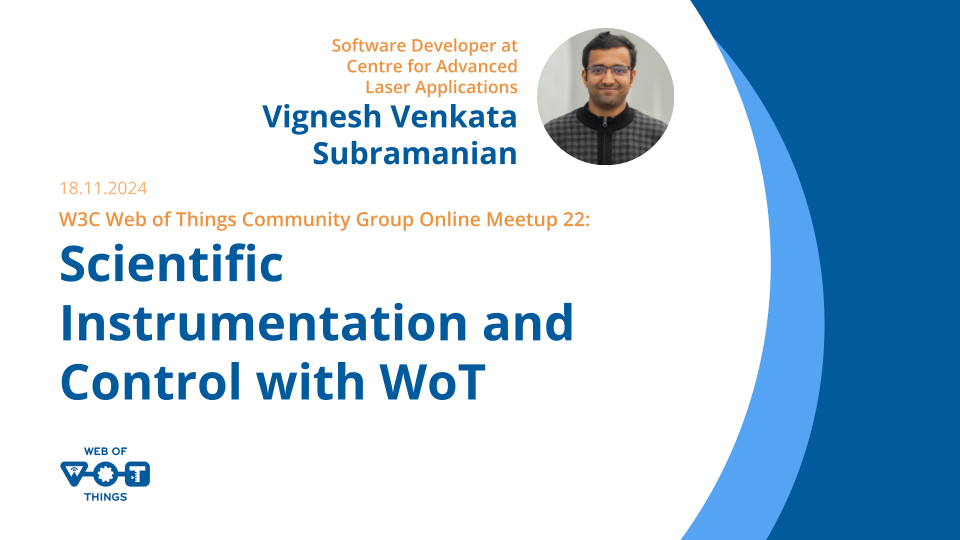</a>

- Name: Scientific Instrumentation and Control with WoT
- Presenter:
  - Vignesh Venkata Subramanian
    

Bio
 Vignesh is a software developer at Centre for Advanced Laser Applications in Munich. Having studied both physics and electrical engineering and gained solid knowledge of hardware, he intends to make scientific data acquisition easy for the python community. He will be there in the WoT Week next week and is excited to meet the community.

- Date: 18 November 2024
- [Presenter Slides](./22/2024-11-WoTCG-Meetup22-Scientific_Instrumentation-CALA.pdf)
- Intro Slides: [Google Slides](https://docs.google.com/presentation/d/1ZorsPNGiC3qEeLarrggwyB6G3rgmRz42_vEz5s8icq8/edit?usp=sharing) | [PDF](./22/2024-11-WoTCG-Meetup22-AguzziKorkan.pdf)
- [Video](https://youtu.be/k2KMKd2ZVq0)
- [Minutes](./22/2024-11-18-minutes.md)
- [W3C Event Page](https://www.w3.org/events/meetings/6373e85a-936c-4c9e-8db4-919a9fcc5635/)

Description

In this meetup, we welcome Vignesh Vaidyanathan who discusses potential applications of WoT in Scientific Instrumentation and Control applications in large-scale experimentation labs. He shows a WoT setup implemented in a 3 Terawatt pulsed laser system to capture data from different scientific instruments with his beginner friendly server side runtime called hololinked. He further demonstrates the use case of state machine in building GUI applications with Eclipse Thingweb node-wot.

## Meetup 21

<a href="https://youtu.be/PpY2TsSIRG4">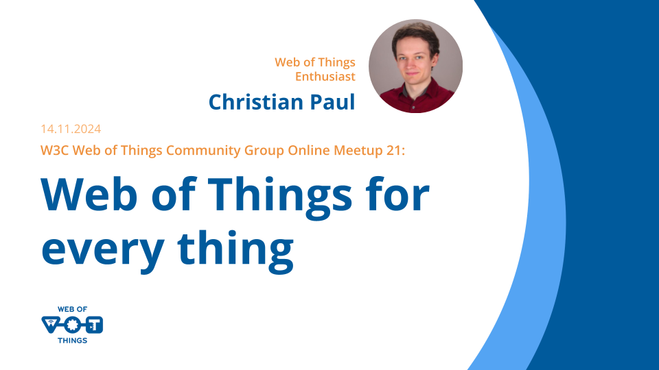</a>

- Name: Web of Things for every thing
- Presenter:
  - Christian Paul
    

Bio
 Christian loves to develop open source software, attends conferences like FOSDEM and has worked in various startups. For the past 7 years, his professional focus has been on the Matrix protocol but he's had an eye on other open standards like Web of Things and ActivityPub building integrations and prototype servers for the joy of experimenting. He lives in Berlin and is looking forward meeting some of you at WoT week later this month.

- Date: 14 November 2024
- [Presenter Slides - Standard](./21/2024-11-WoTCG-Meetup21-WoT_for_every_thing.pdf)
- [Presenter Slides - No Background](./21/2024-11-WoTCG-Meetup21-WoT_for_every_thing-no_background.pdf)
- Intro Slides: [Google Slides](https://docs.google.com/presentation/d/1d4ZZTDzFkLquJyc3O6qypwSfNRZkpdYG6b7yQ_7PXOI/edit?usp=sharing) | [PDF](./21/2024-11-WoTCG-Meetup21-AguzziKorkan.pdf)
- [Video](https://youtu.be/PpY2TsSIRG4)
- [Minutes](./21/2024-11-14-minutes.md)
- [W3C Event Page](https://www.w3.org/events/meetings/27ccdd67-4ad6-476b-bdc2-b1b48da1995b/)

Description

In this meetup, we welcome Christian Paul (GitLab | LinkedIn). Discover how easy it is to build, test and prototype with the Web of Things paradigm. This meetup introduces two new tools for you to use: "WoT Wrench" and "WoT Anything." WoT Wrench is a web app that simplifies debugging and interacting with Things. Meanwhile, WoT Anything serves as a versatile JavaScript server that closely implements WoT standards with a twist - allowing multiple Things to share properties, actions, and events. This approach enables flexible API integration beyond traditional one-to-one device mapping. Christian will demonstrate how virtual Things and API integrations broaden the definition of what can qualify as an IoT device.

## Meetup 20

<a href="https://youtu.be/vRdX5ItQHX0">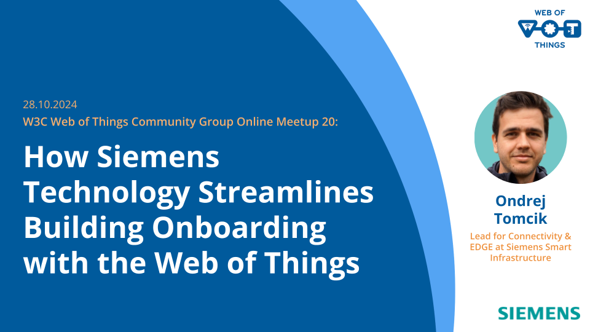</a>

- Name: How Siemens Technology Streamlines Building Onboarding with the Web of Things
- Presenter:
  - Ondrej Tomcik - Siemens
    

Bio
 Ondrej Tomcik is the Lead for Connectivity & EDGE at Siemens Smart Infrastructure in Zug, Switzerland. He focuses on enabling businesses through a platform that commoditises connectivity challenges into accessible APIs. He is an engineer by nature, prioritising solving real user problems and contributing to open-source projects.

- Date: 28 October 2024
- [Presenter Slides](./20/2024-10-WoTCG-Meetup20-Siemens_Smart_Edge_Connector.pdf)
- Intro Slides: [Google Slides](https://docs.google.com/presentation/d/1VixI7ySscHwSAILhx-7cw3nohhnLHSqCxFoCJLJTLzU/edit?usp=sharing) | [PDF](./20/2024-10-WoTCG-Meetup20-AguzziKorkan.pdf)
- [Video](https://youtu.be/vRdX5ItQHX0)
- [Minutes](./20/2024-10-28-minutes.md)
- [W3C Event Page](https://www.w3.org/events/meetings/351c4285-805d-460e-a865-fb58085bd49a/)

Description

In this meetup, we welcome Ondrej Tomcik from Siemens. Every building presents unique challenges, particularly when it comes to provisioning devices such as fire alarms, smart meters, and various sensors. The complexity increases when field devices come from multiple vendors, leading to potential time and cost inefficiencies. Siemens addresses this by leveraging the Web of Things (WoT) standard across both ends: generating Thing Models for Siemens-manufactured devices and enabling south-bound connectivity systems to seamlessly integrate and extract data from diverse devices. Watch this session to explore how Siemens simplifies device provisioning and maximizes the benefits of WoT!

## Meetup 19

<a href="https://youtu.be/dUb_oP2kCBQ">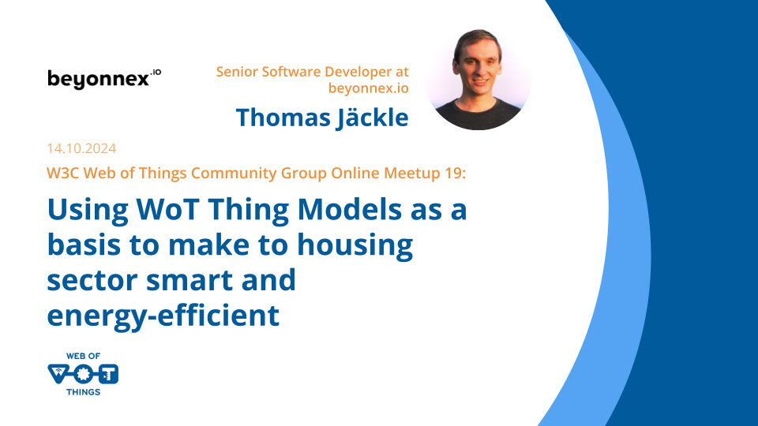</a>

- Name: Using WoT Thing Models as a basis to make to housing sector smart and energy-efficient
- Presenter:
  - Thomas Jaeckle - beyonnex.io
    

Bio
 Thomas is a Software Engineer, currently working at beyonnex.io to build up the "IoT Foundation" used for different use cases in the real estate domain, connecting different devices with the help of digital twins and Eclipse Ditto. Formerly he was at Bosch to create a part of the Bosch IoT Suite. This part, concerning digital twins, was brought to the Eclipse IoT working group as "Eclipse Ditto" project which Thomas is still the project lead and main committer for. In his former role at Bosch he also participated in discussions at the WoT working group, especially around the topic of Thing Models.

- Date: 14 October 2024
- [Presenter Slides](./19/2024-10-WoTCG-Meetup19-TMs_in_Housing_Sector.pdf)
- Intro Slides: [Google Slides](https://docs.google.com/presentation/d/1E8CsW-45U9YBcEFFEUQ5u-K6n4j4j8nkqNRScQRjuUI/edit?usp=sharing) | [PDF](./19/2024-10-WoTCG-Meetup19-AguzziKorkan.pdf)
- [Video](https://youtu.be/dUb_oP2kCBQ)
- [Minutes](./19/2024-10-14-minutes.md)
- [W3C Event Page](https://www.w3.org/events/meetings/ce7176a7-cc24-433a-a675-01e4dd4ff9b5/)

Description

In this meetup, we welcome Thomas Jaeckle from Beyonnex.io! Beyonnex.io is a pioneer in facilitating smart and energy-efficient properties in the housing industry. For their customers, which include landlords and housing companies, they provide solutions to digitally measure and collect energy consumption for residents while also enhancing comfort and promoting energy savings in daily life. They connect various devices and device types to their IoT platform, where Eclipse Ditto serves as the digital twin middleware. These devices share common aspects, such as the location where they are installed by technicians, but differ in functionality. Some devices only collect data, others can be controlled by residents, and some serve to connect other devices to the internet.

This meetup focuses on how Beyonnex.io utilizes Thing Models in combination with Eclipse Ditto. Attendees can expect simplified example models to illustrate how inheritance and composition are used to model their device ecosystem. Additionally, the discussion will touch on the surrounding tooling, such as code generators and model migration tools.

## Meetup 18

<a href="https://www.youtube.com/watch?v=XtJ260RuiWY">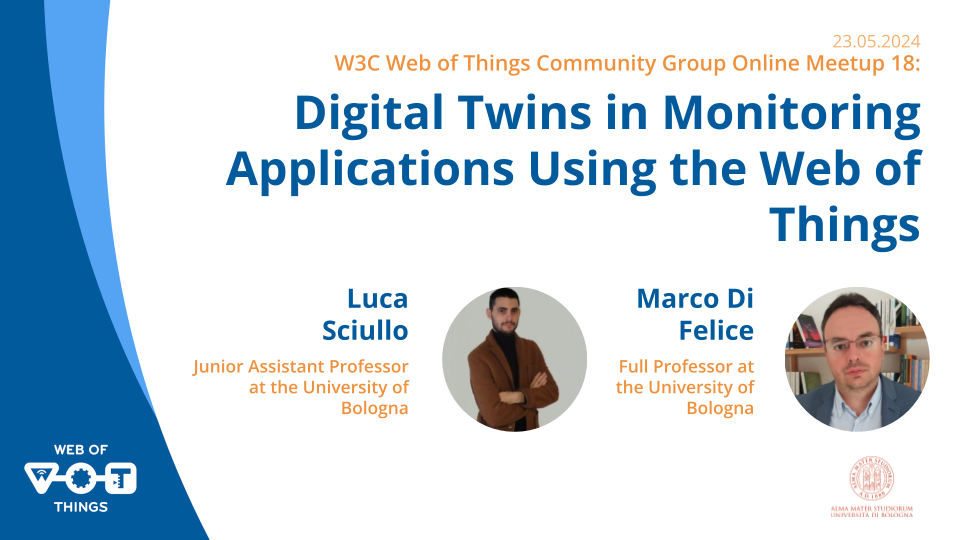</a>

- Name: Digital Twins in Monitoring Applications Using the Web of Things
- Presenters:
  - Marco di Felice - University of Bologna
    

Bio
 Marco Di Felice is a Full Professor at the University of Bologna where he founded the IoT Prism Lab, which focuses on scientific and industrial research in pervasive and mobile systems. He is also faculty member of the international PhD program in Engineering and Information Technology for Structural and Environmental Monitoring and Risk Management (EIT4SEMM) and affiliated to the Advanced Research Center on Electronics Systems (ARCES). He has served as an associate editor for the IEEE Internet of Things journal and the Ad Hoc Networks journal. Currently, he is an associate editor for the Computer Networks journal. He authored more than 160 scientific articles on wireless, pervasive and mobile systems, interoperability and IoT data processing and platforms.

  - Luca Sciullo - University of Bologna
    

Bio
 Luca Sciullo is a Junior Assistant Professor who authored more than 30 papers in both international conferences and journals. He was a Visiting Researcher at the Huawei European Research Center of Munich, Germany. His research interests include wireless systems, Internet of Things (IoT) Systems, Web of Things (WoT), Digital Twin, Industry 4.0, and Blockchains.

- Date: 23 May 2024
- [Presenter Slides](./18/2024-05-WoTCG-Meetup18-DTs_in_Monitoring-difelice_sciullo.pdf)
- Intro Slides: [Google Slides](https://docs.google.com/presentation/d/1Ny17TC6eFp_t6tUo7KuFiWGM5_thqOvkNYaLR2BTMg8/edit?usp=sharing) | [PDF](./18/2024-05-WoTCG-Meetup18-AguzziKorkan.pdf)
- [Video](https://www.youtube.com/watch?v=XtJ260RuiWY)
- [Minutes](./18/2024-05-23-minutes.md)
- [W3C Event Page](https://www.w3.org/events/meetings/d4a1aa3f-a477-4877-8e11-32eb9075a186/)

Description

In this meetup, we welcome Marco Di Felice and Luca Sciullo from the IoT Prism lab of the University of Bologna. In their talk, they focus on data integration and processing for the design and development of large-scale IoT monitoring systems. The talk is structured into two parts. In the first part, they address Structural Health Monitoring (SHM). They discuss the challenges of IoT data collection and demonstrate how they have used the W3C Web of Things (WoT) standards to address the fragmentation of data sources. The second part covers their findings on the automatic generation of IoT systems using the W3C WoT. They present approaches and frameworks that enable the creation of digital twins (DT) from operational W3C Web of Things systems and discuss open issues and future directions in this area.

## Meetup 17

<a href="https://www.youtube.com/watch?v=x6vnqo4j1tA">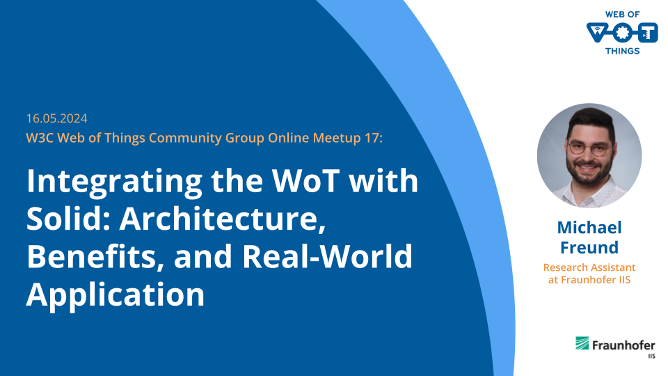</a>

- Name: Integrating the Web of Things with Solid: Architecture, Benefits, and Real-World Application
- Presenter:
  - Michael Freund - Fraunhofer ISS
    

Bio
 Michael is part of the Data Spaces and IoT Solutions group at Fraunhofer IIS and part of the Chair of Technical Information Systems at FAU Erlangen-Nuremberg. His research focuses on enabling read-write linked data interfaces for IoT deployments using Semantic Web technologies, the Web of Things, and Solid. He is currently pursuing his PhD at FAU Erlangen-Nuremberg.

- Date: 16 May 2024
- [Presenter Slides](./17/2024-05-WoTCG-Meetup17-WoT_and_Solid-Freund.pdf)
- Intro Slides: [Google Slides](https://docs.google.com/presentation/d/1qUbYJ6OEp_SSnnXiSUqQJjdpONAfnGh6wE9NhfYsLDY/edit?usp=sharing) | [PDF](./17/2024-05-WoTCG-Meetup17-AguzziKorkan.pdf)
- [Video](https://www.youtube.com/watch?v=x6vnqo4j1tA)
- [Minutes](./17/2024-05-16-minutes.md)
- [W3C Event Page](https://www.w3.org/events/meetings/97420d36-f1d1-47cf-ab35-701c6b8b4cc1/)

Description

The Web of Things enables seamless communication across heterogeneous Internet of Things devices using different communication protocols via a semantic interface description known as a Thing Description. At the same time, Solid servers provide a robust solution for long-term storage and secure sharing of data in the cloud. By combining these technologies through a semantic middleware at the edge, we can leverage the strengths of both in one network architecture. At this meetup, we welcome Michael Freund from Fraunhofer IIS. He highlights the features of the semantic middleware and show how the combined power of the Web of Things and Solid enables easier application development. In addition, he provides insights into a real-world deployment of the architecture at Munich Airport, including implemented applications.

## Meetup 16

<a href="https://www.youtube.com/watch?v=uPhKn-q-ZkA">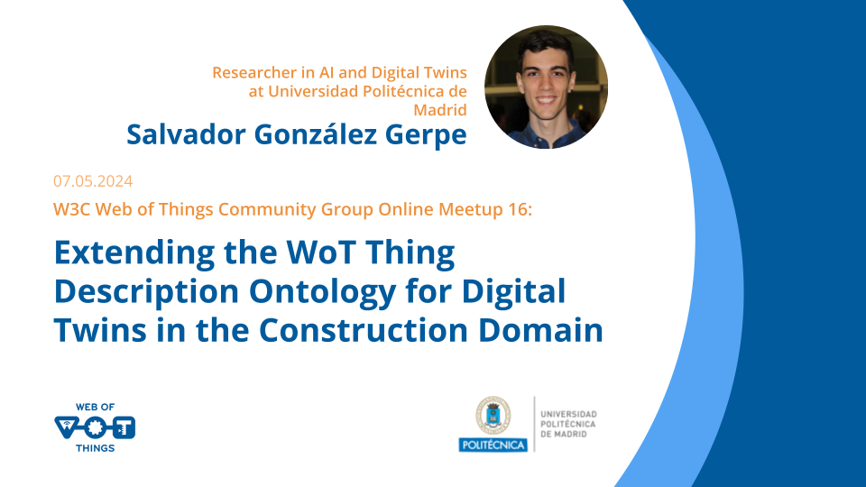</a>

- Name: WoT Digital Twin Ontology
- Presenter:
  - Salvador González Gerpe - Universidad Politécnica de Madrid
    

Bio
 Salvador is a researcher in Artificial Intelligence with extensive knowledge focused on the semantic characterisation of Digital Twins. Graduated in computer engineering with a master's degree in artificial intelligence. Currently, working on a PhD in Artificial Intelligence, with the main focus on semantic characterisation and interoperability between different Digital Twins.

- Date: 7 May 2024
- [Presenter Slides](./16/2024-05-WoTCG-Meetup16-WoTDT-Gerpe.pdf)
- Intro Slides: [Google Slides](https://docs.google.com/presentation/d/1fGmg6lW4JH00OdodfsvvMqcA7O90u57ZHE7REEWt2oY/edit?usp=sharing) | [PDF](./16/2024-05-WoTCG-Meetup16-AguzziKorkan.pdf)
- [Video](https://www.youtube.com/watch?v=uPhKn-q-ZkA)
- [Minutes](./16/2024-05-07-minutes.md)
- [W3C Event Page](https://www.w3.org/events/meetings/1529773f-380c-4536-9504-9cb8c3d35bbf/)

Description

n this meetup, we welcome Salvador González Gerpe from the Ontology Engineering Group at the Universidad Politécnica de Madrid. He takes us back to the concept of Digital Twins with a new ontology, WoTDT. The WoTDT ontology can describe the five-dimensional architecture of a Digital Twin. Furthermore, it allows for the description and location of the metadata belonging to each of the dimensions with the help of WoT.

## Meetup 15

<a href="https://www.youtube.com/watch?v=upUN9-0so2s">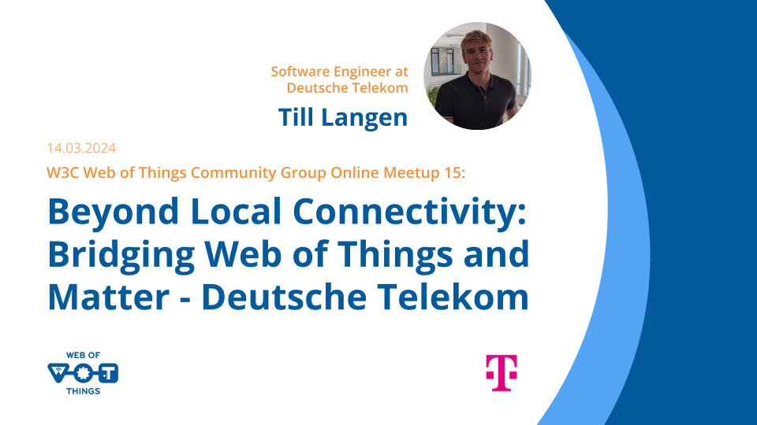</a>

- Name: Beyond Local Connectivity: Bridging Web of Things and Matter
- Presenter:
  - Till Langen - Deutsche Telekom
    

Bio
 Since 2020, Till is working as a part of the MagentaZuhause app team in Deutsche Telekom. Initially, he has worked with Thread and then with Matter. After working on a proof of concept for the integration in the MagentaZuhause architecture, he realized that an abstraction from Matter to Web of Things would make the solution more resource efficient and lightweight.

- Date: 14 March 2024
- [Presenter Slides](./15/2024-03-WoTCG-Meetup15-MatterAndWoT-Langen.pdf)
- Intro Slides: [Google Slides](https://docs.google.com/presentation/d/14jMoUwxGq2J_smzZTjwcXpHN2fIrKAGCczmVx74X3FU/edit?usp=sharing) | [PDF](./15/2024-03-WoTCG-Meetup15-AguzziKorkan.pdf)
- [Video](https://www.youtube.com/watch?v=upUN9-0so2s)
- [Minutes](./15/2024-03-14-minutes.md)
- [W3C Event Page](https://www.w3.org/events/meetings/66be002d-864b-4a49-a4d4-4d231b4c99bf/)

Description

In our next meetup, we welcome Till Langen from Deutsche Telekom to talk about Matter. Matter aims for a standardized Smart Home System, in a local domain. Behind Matter is a merger of the leading hardware and software companies, which is leveraging the distribution. For the scope of a seamless integration in the World Wide Web a mapping from the data model to Web of Things is necessary. This meetup gives an introduction in the Matter data model and a first concept of the abstraction to Web of Things. The concept will look at the function of Matter to bridge devices, compose endpoints and the access control definition.

## Meetup 14

<a href="https://www.youtube.com/watch?v=7FGS10G-YIc">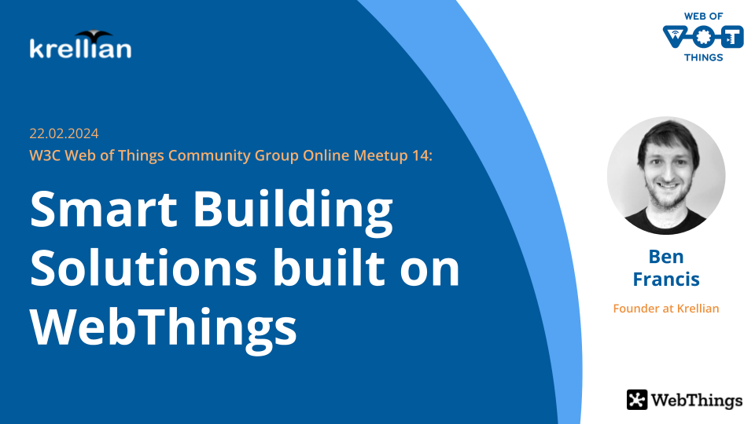</a>

- Name: Smart Building Solutions built on WebThings
- Presenter:
  - Ben Francis - Krellian
    

Bio
 Ben Francis is a Software Engineer and Founder of Krellian. He also founded the Webian and WebThings projects and is a W3C Invited Expert on Web Applications and the Web of Things. He has previously worked for Mozilla and Google.

- Date: 22 February 2024
- [Presenter Slides](./14/2024-02-WoTCG-Meetup14-Francis-Krellian.pdf)
- Intro Slides: [Google Slides](https://docs.google.com/presentation/d/14jMoUwxGq2J_smzZTjwcXpHN2fIrKAGCczmVx74X3FU/edit?usp=sharing) | [PDF](./14/2024-02-WoTCG-Meetup14-AguzziKorkan.pdf)
- [Video](https://www.youtube.com/watch?v=7FGS10G-YIc)
- [Minutes](./14/2024-02-22-minutes.md)
- [W3C Event Page](https://www.w3.org/events/meetings/8772efe6-1a75-4c08-83e5-f92e4165e11f/)

Description

In our 14th meetup, we are delighted to welcome Ben Francis from Krellian. Krellian helps facilities managers of commercial buildings meet their net zero targets whilst saving money, by optimising space utilisation and reducing energy consumption. Krellian's Founder, Ben Francis, talks about his experience building commercial smart building solutions on top of the open source WebThings platform, originally developed at Mozilla for DIY smart homes. This includes developing a smart building analytics service hosted in the cloud, and work towards a production quality version of WebThings Gateway suited to larger commercial buildings. Ben talks about how W3C WoT standards are central to Krellian's products and services and share lessons learned which may help others implementing those standards, and contribute to improving future versions of the specifications.

## Meetup 13

<a href="https://www.youtube.com/watch?v=TI6HUOw6lhU">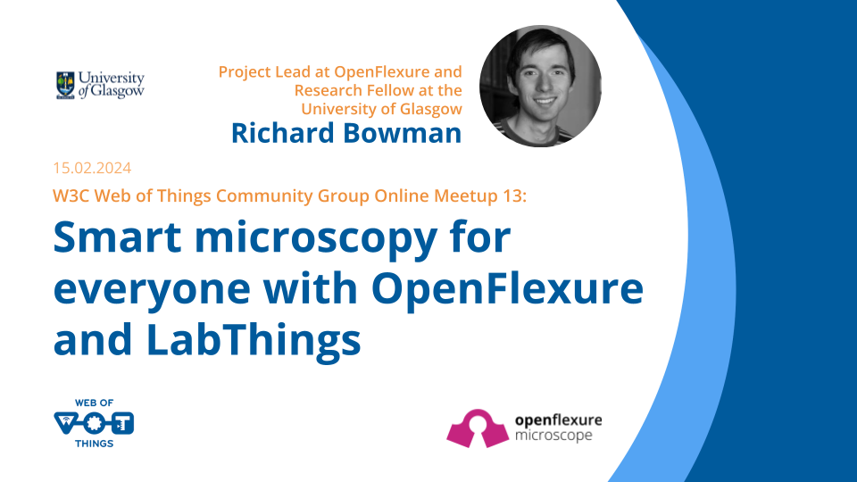</a>

- Name: Smart microscopy for everyone with OpenFlexure and LabThings
- Presenter:
  - Richard Bowman - OpenFlexure and University of Bath
    

Bio
 Richard works on microscopy and experimental automation, including the development of a 3D printable translation stage with sub-micron accuracy. He has transferred a number of technologies to commercial partners, and leads the OpenFlexure project. OpenFlexure sits at the heart of a global community of medics, biologists, entrepreneurs and engineers, making high quality automated microscopy more reproducible and more accessible.

- Date: 15 February 2024
- [Presenter Slides](./13/2024-02-WoTCG-Meetup13-Bowman-openflexure_and_labthings.pdf)
- Intro Slides: [Google Slides](https://docs.google.com/presentation/d/1gz5SQmVnOVMZdzN2rziaQBp8ES_gO7XP96hBvZZ28Sc/edit?usp=sharing) | [PDF](./13/2024-02-WoTCG-Meetup13-AguzziKorkan.pdf)
- [Video](https://www.youtube.com/watch?v=TI6HUOw6lhU)
- [Minutes](./13/2024-02-15-minutes.md)
- [W3C Event Page](https://www.w3.org/events/meetings/dafab839-0eba-46f2-89b1-634539577b9b/)

Description

In 13th meetup, we are delighted to welcome Richard Bowman (LinkedIn, GitHub), who will explore the intersection of open-source software, hardware, and the Web of Things. Richard will introduce us to the OpenFlexure microscope, an open hardware laboratory microscope widely employed in research, teaching, and potentially medical settings across every continent. He will demonstrate how a Web of Things approach has been utilized to enhance user-friendliness, enable automation, and circumvent many of the challenges associated with scientific instrument software. In addition to discussing the microscope, Richard will delve into how the Web of Things approach holds transformative potential in research laboratories.

## Meetup 12

<a href="https://youtu.be/A0PGtoXwPO4">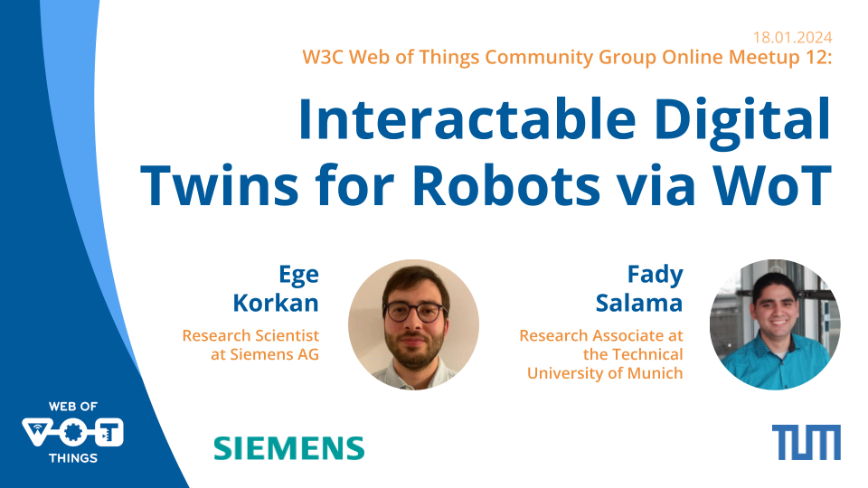</a>

- Name: Interactable Digital Twins for Robots via WoT
- Presenters:
  - Fady Salama - TU Munich
    

Bio
 Fady Salama is a Ph.D. candidate in the Associate Professorship of Embedded Systems and Internet of Things in the School of Computation, Information and Technology (CIT) in the Technical University of Munich (TUM) in Germany. His work centers around exploring how WoT, with possibly some additions, can be used in and benefit industrial applications.

  - Ege Korkan - Siemens
    

Bio
 Ege Korkan is a Research Scientist at Siemens AG in Munich, Germany. He works on the Web of Things topics and is active in the standardization in the Working Group and co-chairs the Community Group.

- Date: 18 January 2024
- [Presenter Slides](./12/2024-01-WoTCG-Meetup12-Korkan-Salama-RobWoT.pdf)
- Intro Slides: [Google Slides](https://docs.google.com/presentation/d/1r_7PrstswVoU_1awFvrcfa6tuQRzm76coDZkPfuY68k/edit?usp=sharing) | [PDF](./12/2024-01-WoTCG-Meetup12-AguzziKorkan.pdf)
- [Video](https://youtu.be/A0PGtoXwPO4)
- [Minutes](./12/2024-01-18-minutes.md)
- [W3C Event Page](https://www.w3.org/events/meetings/0d169482-de20-42b8-8bb1-71b1b8ccb48b/)

Description

In this meetup, we are taking a deep dive into using robotics simulators for building interactable digital twins. Ege Korkan and Fady Salama showcase a new open-source project that bridges CoppeliaSim, a well-known robotics simulator, with Eclipse Thingweb node-wot.

## Meetup 11

<a href="https://youtu.be/VYHjMU5a9FI">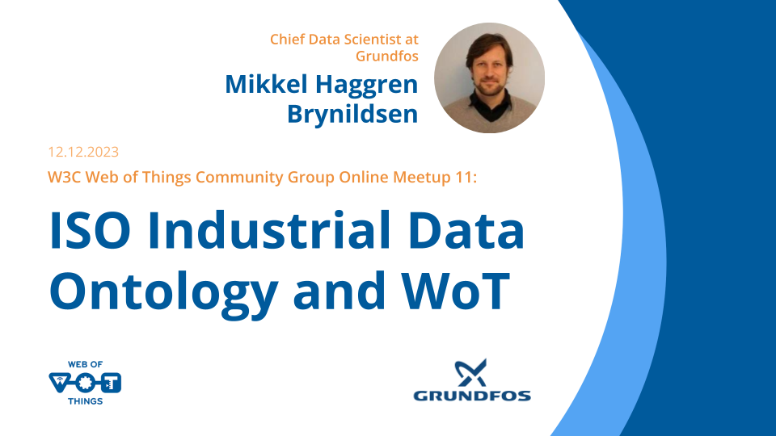</a>

- Name: ISO Industrial Data Ontology
- Presenter:
  - Mikkel Haggren Brynildsen - Grundfos
    

Bio
 Mikkel is the Chief Data Scientist of Grundfos "Data & AI". He holds a MsC in Physics and a PhD in Mathematics. Mikkel is a member of two national boards of standardization for Denmark: one on AI and one on Industrial Data.

- Date: 12 December 2023
- [Presenter Slides](./11/2023-12-WoTCG-Meetup11-MikkelHBrynildsen-ISO_IDO.pdf)
- Intro Slides: [Google Slides](https://docs.google.com/presentation/d/1r_7PrstswVoU_1awFvrcfa6tuQRzm76coDZkPfuY68k/edit?usp=sharing) | [PDF](./11/2023-12-WoTCG-Meetup11-AguzziKorkan.pdf)
- [Video](https://youtu.be/VYHjMU5a9FI)
- [Minutes](./11/2023-12-12-minutes.md)
- [W3C Event Page](https://www.w3.org/events/meetings/3b58fdf1-ab01-4700-88f1-0181396c94d3/)

Description

In our next meetup, we welcome Mikkel Haggren Brynildsen from Grudfos. He talks about the upcoming ISO standard called Industrial Data Ontology that relates to the Web of Things. He explains the motivation behind and the future development of the standard.

## Meetup 10

<a href="https://www.youtube.com/watch?v=LHybkrb3Xek">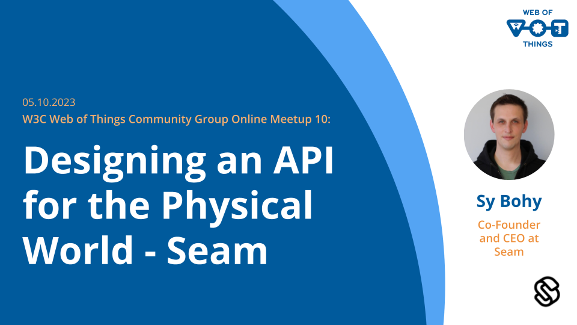</a>

- Name: Designing an API for the Physical World
- Presenter:
  - Sy Bohy - Seam
    

Bio
 With a background in multiple engineering fields and startups, now as the CEO of Seam, he has the goal of building an API for the Things around us.

- Date: 5 October 2023
- [Presenter Slides](./10/2023-10-WoTCG-Meetup10-Seam-SyBohy.pdf)
- Intro Slides: [Google Slides](https://docs.google.com/presentation/d/17Whb-1nKF949bWN3dXjEin7q0nuJW9kUsVXgp3HlcLY/edit?usp=sharing) | [PDF](./10/2023-10-WoTCG-Meetup10-AguzziKorkan.pdf)
- [Video](https://www.youtube.com/watch?v=LHybkrb3Xek)
- [Minutes](./10/2023-10-05-minutes.md)
- [W3C Event Page](https://www.w3.org/events/meetings/251e6917-340c-47f5-a0ed-a3ca85c71102/)

Description

In our next meetup, we welcome Sy Bohy, CEO and Co-Founder of Seam. Sy will talk about Seam's unified API for IoT devices, inspired in some of its designs by the WoT work at W3C. Sy will discuss the origins of Seam, its design constraints, its focus on developer experience, its relationship with IoT manufacturers, and the future that lies ahead for Seam and the IoT industry.

## Meetup 9

This meetup was not recorded due to low attendance

## Meetup 8

<a href="https://www.youtube.com/watch?v=kPfdqGYvBVM">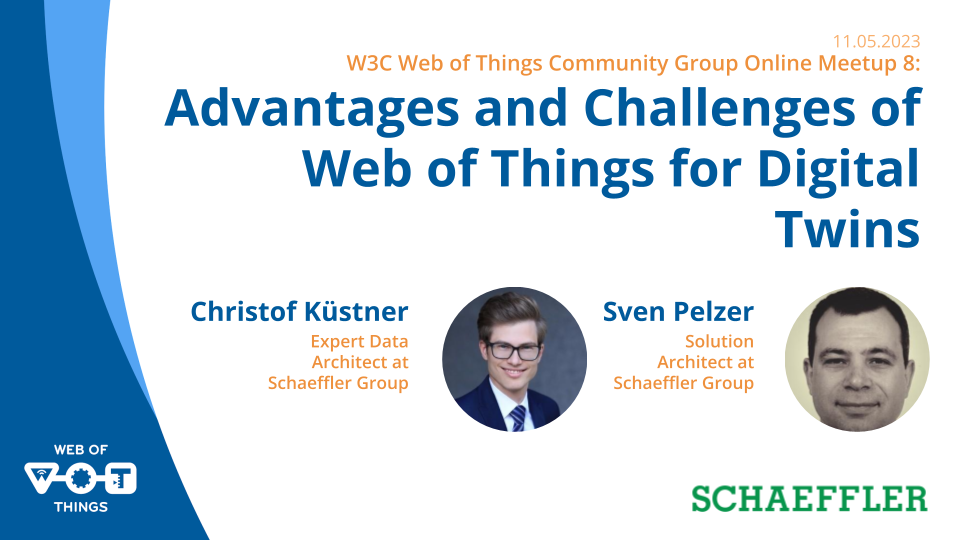</a>

- Name: Advantages and Challenges of Web of Things for Digital Twins
- Presenters:
  - Christof Küstner - Schaeffler
    

Bio
 Christof is an Expert Data Architect at Schaeffler Group. He is experienced in data-driven product development, machine learning, automation, and IT. To tackle new challenges, he leverages a unique combination of traditional mechanical engineering, contemporary information and communication technologies, and data-driven methodologies. He is passionate about driving the digitization of companies and facilitating their transition into the digital era.

  - Sven Pelzer - Schaeffler
    

Bio
 Sven is a Solution Architect at Schaeffler Group. He boasts a career in software development over a range of domains and has been involved with the development of the digital twin offering of Schaeffler Group.

- Date: 11 May 2023
- [Presenter Slides](./08/2023-05-WoTCG-Meetup8-Kuestner_Schaeffler.pdf)
- Intro Slides: [Google Slides](https://docs.google.com/presentation/d/1j1trj42kzy7FWaYR3xne39Ic_PJqjszjEmXIww7x_qU/edit?usp=sharing) | [PDF](./08/2023-05-WoTCG-Meetup8-AguzziKorkan.pdf)
- [Video](https://www.youtube.com/watch?v=kPfdqGYvBVM)
- [Minutes](./08/2023-05-11-minutes.md)
- [W3C Event Page](https://www.w3.org/events/meetings/c51bb82c-70ae-4b77-bc58-40bd80f73fed/)

Description

As a leading global supplier to the automotive and industrial sectors, the Schaeffler Group has been driving forward groundbreaking inventions and developments in the fields of motion and mobility for over 75 years. With innovative technologies, products, and services for electric mobility, CO₂-efficient drives, chassis solutions, Industry 4.0, digitalization, and renewable energies, the company is a reliable partner for making motion and mobility more efficient, intelligent, and sustainable – over the entire life cycle. The technology company manufactures high-precision components and systems for powertrain and chassis applications as well as rolling and plain bearing solutions for a large number of industrial applications.

In addition to the physical product, we are developing digital representations of our product, which we call Digital Twin. We believe that Digital Twins are the driver for optimizing and enhancing Schaeffler products in a data-driven manner. For this, a standardized interface to the data of our products is necessary. In this talk, we show how we utilize Web of Things Standards as a Data Model for the product’s API. We highlight the advantages of using the Web of Things and the challenges we have with the standard.

## Meetup 7

<a href="https://www.youtube.com/watch?v=iqNX9DgFaBM">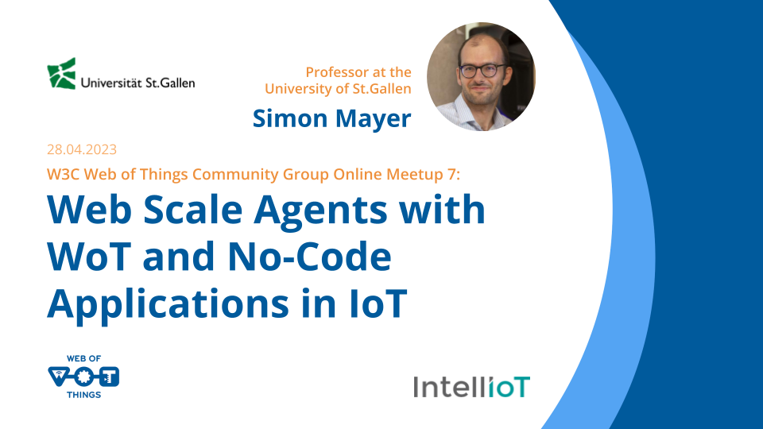</a>

- Name: Web Scale Agents with WoT and No-Code Applications in IoT
- Presenter:
  - Simon Mayer - University of St. Gallen
    

Bio
 Simon is Professor of Interaction- and Communication-based Systems at the University of St.Gallen. Together with his research group (https://interactions.ics.unisg.ch/), he explores interactions among devices and people in ubiquitous computing environments.

- Date: 28 April 2023
- [Presenter Slides](./07/2023-04-WoTCG-Meetup7-Mayer-IntellIoT.pdf)
- Intro Slides: [Google Slides](https://docs.google.com/presentation/d/1Sqr3uJ_6lLoOGJ9z6Uttg5akKNZcB945yaponz26Uz0/edit?usp=sharing) | [PDF](./07/2023-04-WoTCG-Meetup7-AguzziKorkan.pdf)
- [Video](https://www.youtube.com/watch?v=iqNX9DgFaBM)
- [Minutes](./07/2023-04-28-minutes.md)
- [W3C Event Page](https://www.w3.org/events/meetings/a15d3d7d-7815-4da5-8233-01aeb62ee227/)

Description

In our 7th WoT CG Meetup, we welcome a seasoned WoT expert. Simon Mayer from the University of St. Gallen will bring in experience from a recent European project, IntellIoT, and present how the Web of Things can be used to implement web-scale agents. He will also show their Web-based Agent IDE where domain experts can develop no-code applications.

## Meetup 6

<a href="https://youtu.be/xFnrWOeh3pc">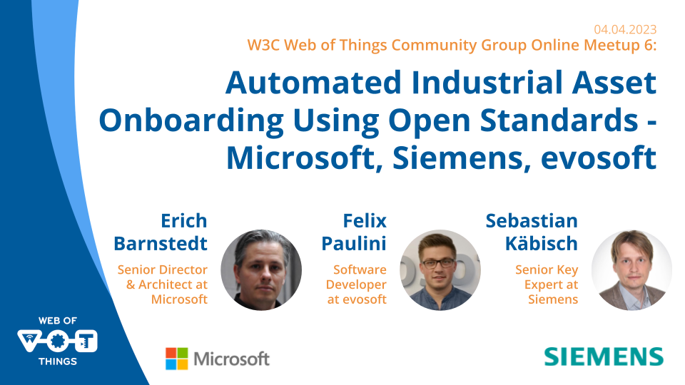</a>

- Name: Automated Industrial Asset Onboarding Using Open Standards
- Presenters:
  - Erich Barnstedt - Microsoft
    

Bio
 Erich has worked in various engineering roles at Microsoft for 20 years, initially in the Windows team and later in the Azure team. Throughout his career, he worked in the automotive and manufacturing verticals and is the founder of both the Windows and the Azure Industrial IoT teams. More recently, he shifted his work to the support of open standards in Microsoft products as well as commitments to open-source and consortia work at Microsoft as Chief Architect. He is the holder of various IoT-related patents and has a bachelor and two master's degrees in computer science from Trinity College, Dublin.

  - Sebastian Käbisch - Siemens
    

Bio
 Sebastian Käbisch is a Senior Key Expert at Siemens Technology in Munich, Germany. His work focuses on the efficient realization and usage of standardized Internet & Web technologies for the Industrial Internet of Things domain. Thereby, he drives strategic initiatives, research and development for Siemens business units such as industrial and building automation. Sebastian Käbisch is an active member and contributor of standardization groups such as ECLASS, Industrial Digital Twin Association, and W3C Web of Things. In the latter he is co-chair and coordinates the topics around the W3C Thing Description.

  - Felix Paulini - Evosoft
    

Bio
 Felix Paulini is a software developer since 2014, with a strong interest in smart automation systems. He started with automation of software quality assurance and quickly changed to develop software solutions for optimization problems. He then developed a lot of connectivity solutions and got in contact with Web of Things in 2019. Since 2021 he is Product Owner for the Siemens InnerSource implementation sayWoT! and enthusiastically spreading the idea of WoT in software solutions.

- Date: 3 April 2023
- [Presenter Slides](./06/2023-04-WoTCG-Meetup6-Siemens-Microsoft.pdf)
- Intro Slides: [Google Slides](https://docs.google.com/presentation/d/1mIqp21oQg92ZrPttWJeM9iE1QcV-JPMcJyY37a9N-bc/edit?usp=sharing) | [PDF](./06/2023-04-WoTCG-Meetup6-AguzziKorkan.pdf)
- [Video](https://youtu.be/xFnrWOeh3pc)
- [Minutes](./06/2023-04-03-minutes.md)
- [W3C Event Page](https://www.w3.org/events/meetings/322db7e4-1a9f-44c6-8ddf-af601043dfb9/)

Description

In this W3C WoT CG Meetups, we welcome Microsoft and Siemens for a joint presentation. Erich Barnstedt from Microsoft, together with Sebastian Käbisch from Siemens and Felix Paulini from evosoft show how the same Thing Description can be used to onboard an industrial asset into the cloud systems of two different organizations. This shows that device descriptions based on common web standards enable real interoperability across IoT stacks and provide a vendor-neutral device onboarding and communication experience.

## Meetup 5

<a href="https://youtu.be/SIKMbxLJXow">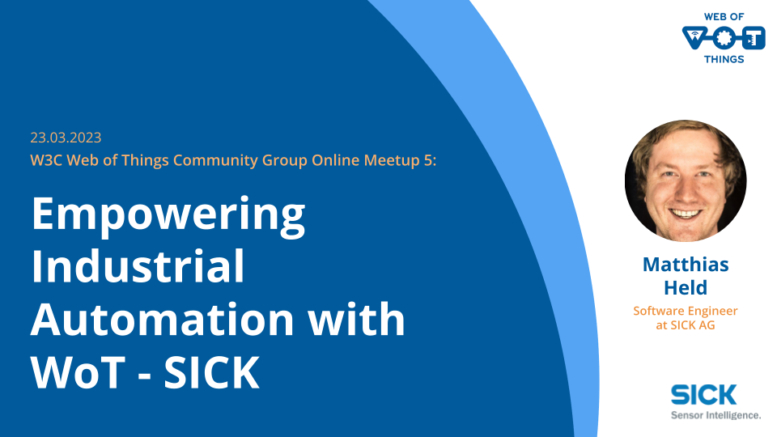</a>

- Name: Empowering Industrial Automation with WoT
- Presenter:
  - Matthias Held - SICK AG
    

Bio
 Matthias Held works as Software Engineer at SICK AG with the main focus on cloud communication of sensors and systems. He acts as software architect and developer for the Digital Twin implementation based on Web of Things.

- Date: 23 March 2023
- [Presenter Slides](./05/2023-03-WoTCG-Meetup5-Held_SICK.pdf)
- Intro Slides: [Google Slides](https://docs.google.com/presentation/d/1LsE6-5ZQ5h_rt2W1zvAE1cVsdrlKCgb4Cf9i2RFYnkk/edit?usp=sharing) | [PDF](./05/2023-03-WoTCG-Meetup5-AguzziKorkan.pdf)
- [Video](https://youtu.be/SIKMbxLJXow)
- [Minutes](./05/2023-03-23-minutes.md)
- [W3C Event Page](https://www.w3.org/events/meetings/e72912b5-3087-440e-950e-886acbab645d/)

Description

In this iteration of the W3C WoT CG Meetups, we welcome Matthias Held from SICK AG. He shows us how they have implemented a full WoT stack where TMs, TD Directories, Edge Gateways, and more are used for their Digital Twin solution. With the help of WoT technologies, they enable low-code onboarding of their sensors to the cloud, while being interoperable.

## Meetup 4

<a href="https://youtu.be/WcCUyn9RUqw">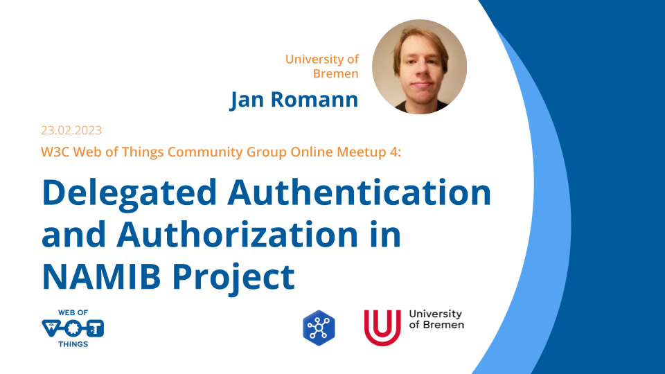</a>

- Name: Delegated Device Authorization in the Web of Things
- Presenter:
  - Jan Romann - University of Bremen
    

Bio
 Jan Romann has a background in political science and is currently working toward a Master's degree in Computer Science at the University of Bremen, Germany. Dealing with the Web of Things for about 2.5 years, he became an Invited Expert to the Working Group in September 2021. His current focus is on the use of CoAP and related technologies in the context of the WoT as well as Thing Model conversion.

- Date: 23 February 2023
- [Presenter Slides](./04/2023-02-WoTCG-Meetup4-Romann.pdf)
- Intro Slides: [Google Slides](https://docs.google.com/presentation/d/1BxWkEPw0off4qOSyS6hsb3kVlJAGX1EU1dQGqdPLYds/edit?usp=sharing) | [PDF](./04/2023-02-WoTCG-Meetup4-AguzziKorkan.pdf)
- [Video](https://youtu.be/WcCUyn9RUqw)
- [Minutes](./04/2023-02-23-minutes.md)
- [W3C Event Page](https://www.w3.org/events/meetings/d29a941e-0bc3-4a2c-abaa-1f711a0ea9a2/)

Description

In this W3C WoT CG Meetup, Jan Romann, Invited Expert at the WoT WG, will present an approach that allows constrained IoT devices to delegate authentication and authorization using the Web of Things. In the framework of the NAMIB project, he will demonstrate this approach in a use case where hotel guests need to have access to their smart environments only during their visits. Additionally, an open-source WoT implementation based on the Dart programming language will be shown, which allows WoT Consumers to be deployed on smartphones.

## Meetup 3

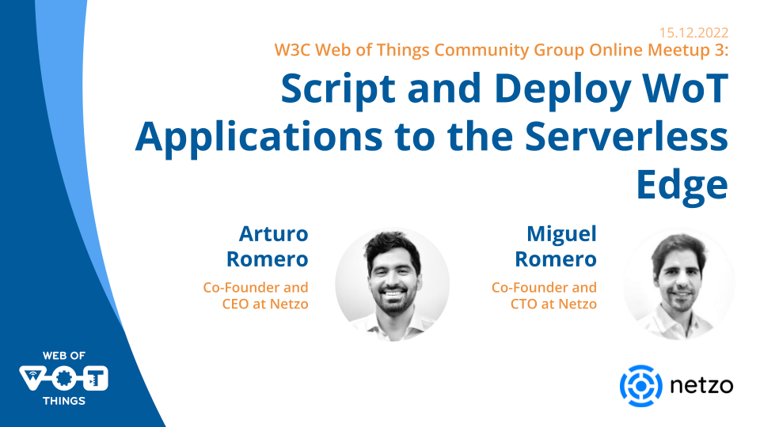

- Name: WoT Applications on the Serverless Edge
- Presenters:
  - Arturo Romero - Netzo.io
    

Bio
 Arturo Romero Karam is co-founder and CEO at Netzo. He holds a M.Sc. in mechanical engineering from the Technical University of Dresden and has experience in leadership, management and digital transformation. As CEO, he is responsible for leading the company's strategic vision and overseeing its operations.

  - Miguel Romero Karam - Netzo.io
    

Bio
 Miguel Romero Karam is co-founder and CTO at Netzo, where he is responsible for the company's technical direction and strategy. He holds a Master's degree in Robotics and Artificial Intelligence from the Technical University of Munich and has experience in mechatronics, robotics, software, and AI.

- Date: 15 December 2022
- [Presenter Slides](./03/2022-12-WoTCG-Meetup3-Netzo-Edge-Computing.pdf)
- Intro Slides: [Google Slides](https://docs.google.com/presentation/d/1fEB38kNR4yICol825EdXD-7ULjxSy0ZO_KozXiMCaSQ/edit?usp=sharing) | [PDF](./03/2022-12-WoTCG-Meetup3-AguzziKorkan.pdf)
- No Video Available
- [Minutes](./03/2022-12-15-minutes.md)
- [W3C Event Page](https://www.w3.org/events/meetings/f49cc19b-66a6-4d4c-a9c1-0ca327908486/)

Description

In this W3C WoT CG Meetup, the focus was on the topic of Edge Computing. Arturo and Miguel Romero Karam presented Netzo, a scripting platform for developers that streamlines the integration of APIs, the automation of workflows and the creation of internal tools by allowing JavaScript/TypeScript scripts to be deployed to URL endpoints, and showed how WoT applications can be deployed with it. The talk was followed by a discussion on Edge Computing solutions and how the Web of Things can address the related challenges.

## Meetup 2

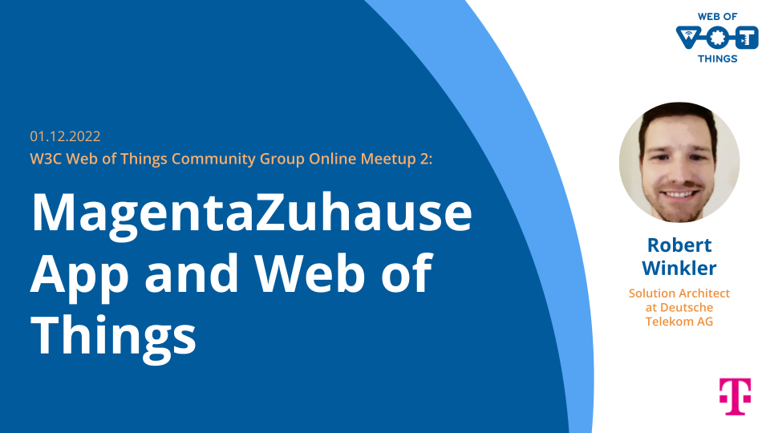

- Name: Magenta Smart Home
- Presenter:
  - Robert Winkler - Deutsche Telekom
    

Bio
 Robert Winkler works as a solution architect at Deutsche Telekom AG in Darmstadt, Germany. He is responsible for the architecture of Magenta Smart Home and MagentaZuhause App. He is also the creator of Resilience4j. Resilience4j is a lightweight fault tolerance library designed for functional programming that is used by multiple companies worldwide.

- Date: 1 December 2022
- [Presenter Slides](./02/2022-08-WoTCG-Meetup2-MagentaZuhauseApp-Winkler.pdf)
- Intro Slides: [Google Slides](https://docs.google.com/presentation/d/13jKtDYPREKXW9e0BM_6bA__aocjGkEq37DxuQ3bMBDY/edit?usp=sharing) | [PDF](./02/2022-12-WoTCG-Meetup2-AguzziKorkan.pdf)
- No Video Available
- [Minutes](./02/2022-12-01-minutes.md)
- [W3C Event Page](https://www.w3.org/events/meetings/07d67134-f9d0-4c8a-ba1e-24f25babef8c/)

Description

In this W3C WoT CG Meetup, the focus was on smart home solutions. Robert Winkler from Deutsche Telekom presented the architecture of Magenta Smart Home and the MagentaZuhause App, which implement technologies inspired by the Web of Things. The session continued with questions from the attendees and a broader discussion on how Web of Things standards can address the challenges of smart home IoT systems.

## Meetup 1

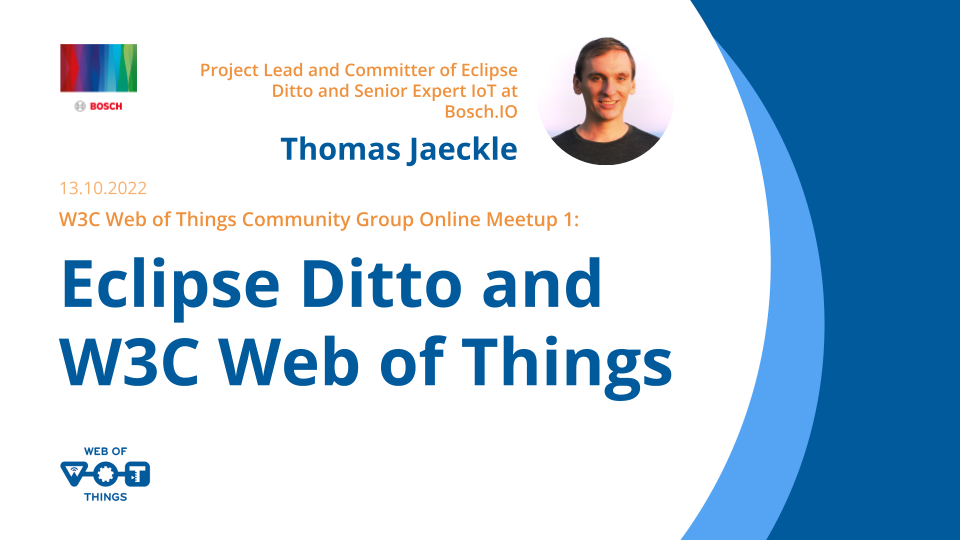

- Name: Digital Twins with Eclipse Ditto and Web of Things
- Presenter:
  - Thomas Jaeckle - Bosch.io
    

Bio
 Thomas Jäckle is Committer and Project Lead of the Eclipse Ditto project which was created in 2017. As a Senior Expert for IoT and Lead Software Developer for the commercial Bosch IoT Things cloud service he works for Bosch.IO GmbH, one of the leading members of the Eclipse IoT working group. He is also part of the WoT Working Group and contributor to the Thing Description.

- Date: 13 October 2022
- [Presenter Slides](./01/2022-10-WoTCG-Meetup1-EclipseDitto-and-WoT-Jaeckle.pdf) ([Online Version](https://www.eclipse.org/ditto/slides/2022_10_ditto-and-wot/))
- Intro Slides: [Google Slides](https://docs.google.com/presentation/d/1iOCkNmtA10AuDTyHKswk26siCU2AAGNOzQsUm15BQYw/edit?usp=sharing) | [PDF](./01/2022-10-WoTCG-Meetup1-AguzziKorkan.pdf)
- No Video Available
- [Minutes](./01/2022-10-13-minutes.md)
- [W3C Event Page](https://www.w3.org/events/meetings/c8802811-42b9-4089-a823-8671e3c3a227/)

Description

In this W3C WoT CG Meetup, the focus was on the topic of digital twins. Thomas Jaeckle presented Eclipse Ditto, an open-source framework to help build digital twins of devices connected to the Internet, whose latest version supports the W3C Web of Things specifications. The presentation was followed by a panel discussion in which attendees shared their perspectives, needs and use cases around digital twins, and explored how W3C Web of Things technologies contribute to this domain.

## Meetup 0

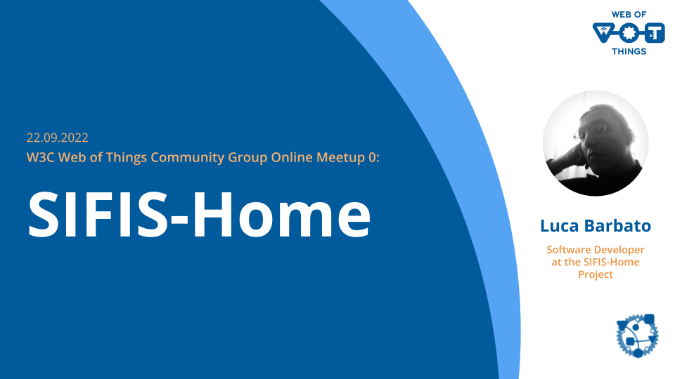

- Name: wot-rust and "How to build a Community"
- Presenters:
  - Luca Barbato - Luminem
    

Bio
 Long time open source developer, he fixed and made plenty of mistakes (mis)managing memory accesses in Gentoo and Videolan until he started using and contributing to Rust. He is writing a pure rust implementation of Web of Things as part of his efforts in the Horizon 2020 project SIFIS-Home.

  - Philipp-Alexander Blum - Bind Systems
    

Bio
 Tech-Blogger (Tabtech.de, bought by GIGA Tech). TV commercials, Online-Marketing, Development (Tollabox). Big data analytics & MarTech (Webtrekk, bought by Mapp Digital). Cryptocurrencies & DLTs (IOTA Foundation). Pushing Open Source and Open Standards forward (Bind.systems).

- Date: 22 September 2022
- [Presenter Slides - Luca Barbato](./0/2022-09-WoTCG-Meetup0-wot_rust-Barbato.pdf) ([Online Version](https://docs.google.com/presentation/d/17Uod5HT5Se_XMt0cE-X12ud-DdwrzoAnDEovT4JFZx8/edit?usp=sharing))
- [Presenter Slides - Philipp-Alexander Blum](https://github.com/bind-systems/wot-cg-0-how-to-build-a-community/blob/master/assets/wot-cg-0-how-to-build-a-community.pdf)
- Intro Slides: [Google Slides](https://docs.google.com/presentation/d/1u8OlKdJnq4bqRTtJ4lP2rwVph_Vl_fuvxYi2iZy9sz8/edit?usp=sharing) | [PDF](./0/2022-09-WoTCG-Meetup0-AguzziKorkan.pdf)
- No Video Available
- [Minutes](./0/2022-09-22-minutes.md)
- [W3C Event Page](https://www.w3.org/events/meetings/05b36b01-51bf-4885-88ea-eac638159f71/)

Description

In this first W3C WoT CG Meetup, Web of Things implementers and enthusiasts gathered to discuss where the community would be hosted (chat platforms, social media, etc.) and to hear feedback from implementers along with their stories about creating WoT-enabled platforms. Luca Barbato presented wot-rust, a pure Rust implementation of the Web of Things written as part of the Horizon 2020 project SIFIS-Home, and Philipp-Alexander Blum shared his experience on how to build a community.

